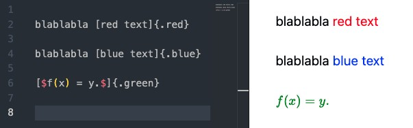

Adds [Markdown-it-attributes](https://www.npmjs.com/package/markdown-it-attributes) (with [markdown-it markdown parser](https://www.npmjs.com/package/markdown-it-bracketed-spans)) to VS Code's built-in Markdown preview.

**Input**

```markdown
text [with class red]{.red}

text [with color red]{color=red}

text [with attr]{attr1=value1 attr2=value2}
```

**Output**

```html
<p>text <span class="red">with class red</span></p>
<p>text <span color="red">with color red</span></p>
<p>text <span attr1="value1" attr2="value2">with attr</span></p>
```


## Text color

We use `style.css` so that we can set text color using the format `[text]{.color}`.



If you want this format to work in `quarto` compiled documents, you can use the `color.lua` filter.

**Input**

```
---
filters: 
  - color.lua
---
blablabla [red text]{.red}

blablabla [blue text]{.blue}
```

**Output**

```html
<p>blablabla <span class="red" style="color: red;">red text</span></p>
<p>blablabla <span class="blue" style="color: blue;">blue text</span></p>
```